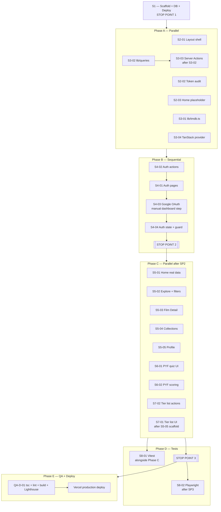
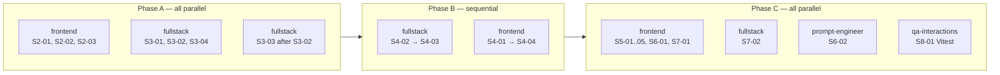
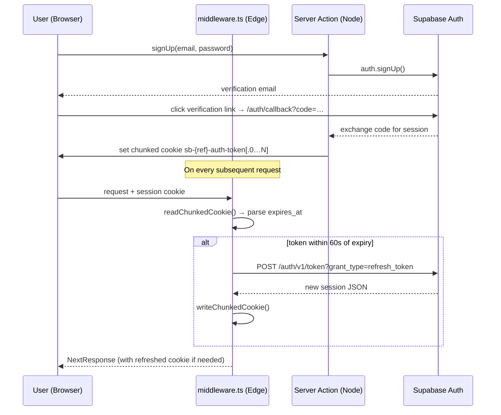

# ScaryMoovies Prototype — S2–S8 Execution Workflow

> `docs/PLAN.md` is the source of truth. This file describes ordering and gates only.

---

## Execution Phases

```
Phase A  — Layout Shell + Data Layer foundations (parallel)
Phase B  — Auth (sequential gate)
Phase C  — Feature pages + Quiz + Tier List (parallel after Stop Point 2)
Phase D  — Tests (Vitest alongside C; Playwright after Stop Point 3)
Phase E  — QA + Deploy
```

### Phase & dependency overview



### Agent parallelisation map



### Auth sequence



---

## Phase A — Parallel (no auth dependency)

Run simultaneously after S1 approval:

```
frontend  → S2-01  Layout shell (navbar, root layout)
frontend  → S2-02  Token audit
frontend  → S2-03  Home page placeholder
fullstack → S3-01  lib/tmdb.ts (server utilities)
fullstack → S3-02  lib/queries/* (Drizzle helpers)
fullstack → S3-04  TanStack Query provider
```

**Constraint:** S3-03 (Server Actions) needs S3-02 first — run S3-03 sequentially after S3-02.

**Phase A exit:** `tsc --noEmit` + `npm run lint` + `npm run build` pass. QA-F-01 runs.

---

## Phase B — Sequential (auth gate)

Must run in order:

```
S4-02  Auth Server Actions (sign-up, sign-in, sign-out, magic-link, reset)
  └─► S4-01  Auth pages (forms consume actions)
        └─► S4-03  Google OAuth (needs S4-02 + manual Supabase dashboard config)
              └─► S4-04  Auth state in navbar + route guard
```

**Manual step inside Phase B:** Google Cloud OAuth credentials must be added to
Supabase dashboard before S4-03 can be tested. Flag and continue other work while
waiting; OAuth is not a blocker for S4-01/S4-02.

**► Stop Point 2 (human gate):**
- Signup → email verification → profile
- Login / logout
- Forgot password email + reset
- Google OAuth creates `public.users` row

Do not start Phase C until Stop Point 2 is approved.

---

## Phase C — Parallel (after Stop Point 2)

```
frontend  → S5-01  Home page (real TMDB data)          ← needs S3-01, S3-02
frontend  → S5-02  Explore (dual filter)               ← needs S3-01
frontend  → S5-03  Film Detail                         ← needs S3-01, S3-03, S4
frontend  → S5-04  Collections                         ← needs S3-03, S4
frontend  → S5-05  Profile                             ← needs S3-02, S4
frontend  → S6-01  PYF quiz UI                         ← needs S2-01
prompt-e  → S6-02  PYF scoring + recommendation logic  ← needs S3-01, S3-02
fullstack → S7-02  Tier list Server Actions            ← needs S3-02, S3-03, S4
```

S7-01 (tier list UI) can start after S5-05 scaffold exists but needs S7-02 for
write interactions. Structure it as: scaffold read-only UI → wire S7-02 → add writes.

**Constraint:** S6-01 result screen must wait for S6-02 (scoring). Start S6-01
with static mock results, replace with real scoring once S6-02 is done.

**Phase C exit:** All feature pages render with real data. `tsc` + `lint` + `build` clean.
QA-F-02, QA-F-03, QA-I-01, QA-I-02, QA-I-03 run.

---

## Phase D — Tests

```
S8-01  Vitest unit tests — start alongside Phase C (no running app needed)
S8-02  Playwright e2e  — start ONLY after Stop Point 3
```

**► Stop Point 3 (human gate):**
- Full e2e: signup → rate film → add to watchlist → write review → view `/profile/me`
- RLS security: unauth INSERT to `ratings` returns error
- Ownership: user A cannot update user B's rating
- Playwright suite green
- Lighthouse mobile > 85

---

## Phase E — QA + Deploy

```
QA-D-01  tsc + lint + build + Lighthouse ≥ 85 mobile
devops   → Vercel production deploy
```

---

## What Can Run in Parallel

| Can parallelize | Cannot parallelize |
|---|---|
| S2-01, S2-02, S2-03, S3-01, S3-02, S3-04 (Phase A) | S4-02 → S4-01 → S4-03 → S4-04 |
| S5-01 through S5-05, S6-01, S6-02, S7-02 (Phase C) | S8-02 Playwright before Stop Point 3 |
| S8-01 Vitest alongside any Phase C task | Vercel deploy before QA-D-01 |

---

## Auth / Fullstack Dependency Graph

```
S1 (DB schema + Supabase)
  │
  ├── S3-02 (Drizzle queries)
  │     └── S3-03 (Server Actions)
  │           ├── S5-03 Film Detail (rate, watchlist, review)
  │           ├── S5-04 Collections (create/edit)
  │           └── S7-02 Tier list writes
  │
  └── S4-02 (Auth actions)
        └── S4-04 (Auth state, route guard)
              ├── S5-03, S5-04, S5-05 (auth-gated features)
              └── S7-01 (own tier list editable)
```

---

## Commit Strategy

- Commit per logical unit (one component, one action file, one page) — not per file save.
- Commit message format: `feat(scope): description` / `fix(scope):` / `test(scope):`
- Always run `tsc --noEmit + lint` before committing.
- Never commit `.env*` files or real secrets.
- Push after each commit so Vercel preview builds reflect current state.
- One commit per Stop Point gate (consolidate if needed before human review).

---

## Test Strategy

| Layer | Tool | When |
|---|---|---|
| Unit — PYF scoring, action logic | Vitest | Alongside Phase C |
| Unit — RLS logic paths | Vitest | Alongside Phase C |
| E2e — full user flows | Playwright | After Stop Point 3 |
| Visual / token | Manual browser check | After each feature page |
| Performance | Lighthouse (mobile) | Phase E; target ≥ 85 |

---

## Rollback / Escalation

| Situation | Action |
|---|---|
| TypeScript errors block build | Stop, fix before next task. Spawn `debug` agent if root cause is unclear. |
| Auth flow broken after S4 | Revert to last passing commit; isolate Supabase config vs. code. `debug` agent. |
| Vercel deploy fails (not middleware) | Check build output; confirm no `output: "export"`; check env vars in Vercel dashboard. |
| Middleware failure (Edge runtime) | Do NOT re-add `@supabase/ssr` import to `middleware.ts`. See `docs/DECISIONS.md`. |
| RLS rejects valid actions | Check Supabase policies with verification query; confirm `auth.uid()` matches user. |
| Stop Point gate fails | Do not advance phase. Fix and re-run gate checklist. |
| Phase C blocked on auth delay | Continue read-only UI work (no auth gate); mock auth state where needed. |
